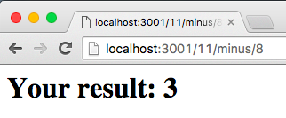

# Route Calculator

We're going to create a server that acts as a calculator via routes! For example:

```
wes:route-calculator/ (master✗) $ curl http://localhost:3001/3/plus/10/                                          [16:30:29]
>> Your result: 13
```


### Setup:

1. Fork & clone this repository

1. Create an `app.js` file and a `logic.js` file

1. Use those files to complete the activity described below


### Instructions:

The goal of this exercise is to create a server that returns calculations based on the URL's route. You should be able to add, subtract, multiply, and divide two numbers. The result of the calculation should be returned when the route is hit. The required functionality is for the server to be able to respond to routes via a curl request.

> As a stretch goal, have the ouput be formatted in HTML, like so:

> 

The first and third part of the URI's path should be numbers and the middle must be a specified operator. For example, the following should return an error.

```
wes:route-calculator/ (master✗) $ curl http://localhost:3001/ten/foo/eleven
>> There was an error.
```

URIs that are too short or too long should also be rejected.

```
wes:route-calculator/ (master✗) $ curl http://localhost:3001/hello/world
>> Please check your uri and try again.                                                                                     

wes:route-calculator/ (master✗) $ curl http://localhost:3001/3/plus/10/minus/11
>> Please check your uri and try again.
```

Finally, it should not matter if you have a trailing forward slash at the end of your URI:

```
wes:route-calculator/ (master✗) $ curl http://localhost:3001/3/plus/10/
>> Your result: 13

wes:route-calculator/ (master✗) $ curl http://localhost:3001/3/plus/10
>> Your result: 13
```
